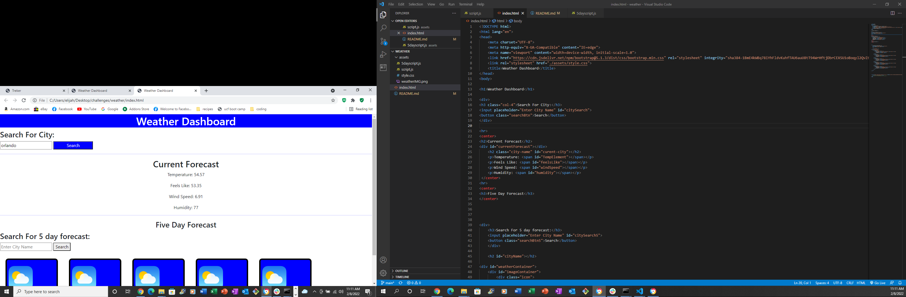

# weather

in this project I first started by making some basic html

I then worked in javascript to link data from an api to my hardcoded txt in html so when you type in a city the current temperature will apear

I then tried to connect the 5 day weather forecast api to a hardcoded area in my html for 5 days of accurate weather conditions but I never was able to get it to work